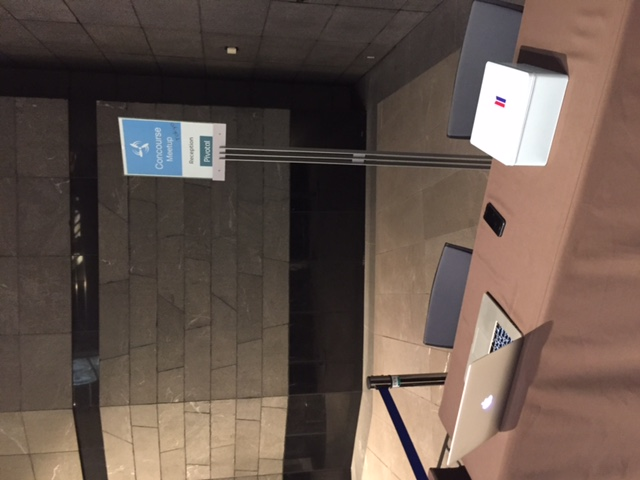

### Concourse Meetup Tokyo #1

http://www.meetup.com/Concourse-CI-Tokyo-Meetup/events/230332948/

Around 50 attendee !

## Talk
Concourse overview (Gwenn Etourneau, Pivotal) 
 * Demo & Material https://github.com/shinji62/concourse-meetup-goserv
 * Slide http://www.slideshare.net/gwennetourneau/concourseci-overview

Auto-Scaled ConcourseCI on AWS without BOSH (Yusuke Kuoaka, ChatWork) 
 * Demo & Material https://github.com/mumoshu/concourse-aws
 * Slideshare   http://www.slideshare.net/mumoshu/autoscaled-concourse-ci-on-aws-wo-bosh

Manage your docker image with Concourse  (Gwenn Etourneau, Pivotal)
 * Demo & Material https://github.com/shinji62/alpine-docker-golang-bash 
 * Slide http://www.slideshare.net/gwennetourneau/concourseci-dockerimage
  
Install ConcourseCI with bosh (Toshiaki Maki, Pivotal) 
 * Demo & Material https://github.com/making/concouse-ci-manifest-samples
 * Slide http://www.slideshare.net/makingx/install-concourse-ci-with-bosh

Code Cycle demo (Toshiaki Maki, Pivotal)  
 * Demo & Material https://github.com/making/concourse-ci-demo
 * Slide http://www.slideshare.net/makingx/concourse-ci-meetup-demo

#Picture
 You can find all picture there
https://drive.google.com/folderview?id=0B6-cY13f0pq6NFBEWmJmbzh5X1U&usp=sharing

